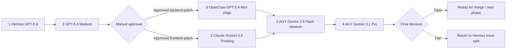

# AI-SmartBook-R1-PR4 Agent Assignment Matrix

> Purpose: map the approved PR4 work plan to concrete agents and model settings.
>
> Repo: `b827262-cell/AI-SmartBook-R1-PR4`
>
> Branch: `docs/pr4-main-architecture-sqlite-policy`
>
> Related docs:
> - `docs/ops/AI-SmartBook-R1-PR4-hermes-engineering-plan.md`
> - `docs/ops/AI-SmartBook-R1-PR4-agent-division-flow.md`
> - `docs/ops/AI-SmartBook-R1-PR4-task-dispatch.md`

---

## 1. Approved Agent / Model Assignment

| No. | Agent | Model / Mode | Primary responsibility | Output |
| --- | --- | --- | --- | --- |
| 1 | Hermes | GPT-5.4 | Planning, issue splitting, approval list, engineering plan maintenance. | Markdown plans, issue drafts, approval checklist. |
| 2 | GPT-5.4 Medium | GPT-5.4 Medium | Architecture review, issue wording, risk analysis, patch boundary review. | Review notes, refined task prompts, risk list. |
| 3 | Claude Sonnet 4.6 Thinking | Claude Sonnet 4.6 Thinking | Frontend/UI implementation planning and careful code-review of React component changes. | UI patch proposal, frontend review, component impact notes. |
| 4 | AGY | Gemini 3.1 Pro | Senior verification and final review of architecture, SQLite safety, and merge readiness. | Final acceptance report or rejection list. |
| 5 | AGY | Gemini 3.5 Flash Medium | Fast verification, regression checklist, UI sanity check, report summarization. | Quick QA report and checklist result. |
| 6 | OpenClaw | GPT-5.4 Mini xhigh | Focused coding agent for approved small backend/frontend patches. | Code patch, validation report, termination report. |

---

## 2. Recommended Execution Order



---

## 3. Agent-by-Agent Work Definition

### 3.1 Hermes — GPT-5.4

Use Hermes for planning and documentation first.

Tasks:

- Maintain `AI-SmartBook-R1-PR4-hermes-engineering-plan.md`.
- Create issue-splitting draft.
- Create manual approval list.
- Separate work into safe implementation, analysis-only, and deferred groups.
- Do not write feature code unless separately approved.

Recommended next Hermes output:

```text
docs/ops/AI-SmartBook-R1-PR4-issue-splitting-and-approval-list.md
```

---

### 3.2 GPT-5.4 Medium

Use GPT-5.4 Medium as architecture reviewer and task refiner.

Tasks:

- Review Hermes issue-splitting draft.
- Check that each task has a clear scope.
- Confirm each task has an explicit do-not-touch boundary.
- Refine prompts before sending to coding agents.
- Flag any task that risks schema, migration, OAuth, docker-compose, PDF core, Ask AI core, or lesson-point completion logic.

Output:

- Refined task prompts.
- Risk notes.
- Permission-halt list if needed.

---

### 3.3 Claude Sonnet 4.6 Thinking

Use Claude Sonnet 4.6 Thinking for frontend/UI design and careful React review.

Best task fit:

- SmartBook category display normalization.
- UI display consistency.
- React component boundary review.
- `SmartBooks.tsx` / `SmartBooksBookTabs.tsx` display behavior.

Allowed first review files:

- `client/src/lib/smartBookCategoryDisplay.ts`
- `client/src/pages/SmartBooks.tsx`
- `client/src/pages/SmartBooksBookTabs.tsx`
- `client/src/pages/AdminSmartBooks.tsx` only if approved

Do not touch:

- backend schema
- migrations
- docker-compose
- OAuth
- PDF reader core
- Ask AI core
- lesson-point completion logic

---

### 3.4 AGY — Gemini 3.1 Pro

Use AGY Gemini 3.1 Pro as senior final reviewer.

Tasks:

- Review final branch diff.
- Confirm no forbidden architecture changes.
- Confirm SQLite-safe policy is not weakened.
- Confirm manual approvals match actual changes.
- Decide merge readiness.

Output:

- Final acceptance report.
- Merge recommendation or rejection list.

---

### 3.5 AGY — Gemini 3.5 Flash Medium

Use AGY Gemini 3.5 Flash Medium for fast read-only QA.

Tasks:

- Run checklist verification.
- Summarize build/test results.
- Verify user-facing flows at a high level.
- Confirm changed files remain within approved boundaries.

Focus:

- Book list opens.
- Single-book page opens.
- PDF still loads.
- Mobile PDF layout not broken.
- Progress panel still works.
- Knowledge-point panel still works.
- No forbidden file changes.

---

### 3.6 OpenClaw — GPT-5.4 Mini xhigh

Use OpenClaw GPT-5.4 Mini xhigh as the focused coding agent after approval.

Best task fit:

- `smart_book_settings` missing-table fallback parity.
- Small backend router patch.
- Small frontend patch only if prompt is tightly scoped.

Allowed first backend files:

- `server/routers/smartBookRouter.ts`
- `server/routers/smartBookLearningRouter.ts`
- `server/routers/featureTogglesRouter.ts`

Do not touch:

- `drizzle/schema.ts`
- migration files
- `docker-compose.yml`
- OAuth files
- PDF reader core
- Ask AI core
- lesson-point completion logic

---

## 4. Work Allocation by Issue Type

| Work type | Primary agent | Review agent | Final verification |
| --- | --- | --- | --- |
| Issue splitting and approval list | Hermes GPT-5.4 | GPT-5.4 Medium | AGY Gemini 3.1 Pro |
| Category display normalization | Claude Sonnet 4.6 Thinking or OpenClaw GPT-5.4 Mini xhigh | GPT-5.4 Medium | AGY Gemini 3.5 Flash Medium |
| `smart_book_settings` fallback parity | OpenClaw GPT-5.4 Mini xhigh | GPT-5.4 Medium | AGY Gemini 3.5 Flash Medium |
| SQLite portability analysis for PDF notes | Hermes GPT-5.4 | GPT-5.4 Medium | AGY Gemini 3.1 Pro |
| Final acceptance | AGY Gemini 3.1 Pro | PM / Product Owner | PM / Product Owner |

---

## 5. Guardrails for All Agents

All agents must preserve these boundaries:

- Keep AI-SmartBook-R1 as the main architecture.
- Keep the first phase as SQLite-safe policy work.
- Do not port OAuth.
- Do not port TiDB or MySQL architecture.
- Do not modify `drizzle/schema.ts` unless a separate approved data-model issue exists.
- Do not modify migration files.
- Do not modify `docker-compose.yml`.
- Do not commit secrets or environment values.
- Do not rewrite PDF reader core.
- Do not rewrite Ask AI core.
- Do not rewrite lesson-point completion logic.

---

## 6. Required Termination Report Format

Every agent must finish in Traditional Chinese:

```markdown
- 狀態
  - success: <完成項目>
  - failure: <失敗項目，沒有則寫「無」>
  - blocker: <阻礙項目，沒有則寫「無」>
  - permission-halt: <權限或需人工確認項目，沒有則寫「無」>
```

Recommended extra fields:

- agent / model
- current branch
- commit SHA
- changed files
- validation commands
- validation result
- next recommended action

---

## 7. Immediate Next Dispatch

Recommended next dispatch:

```text
Agent: Hermes GPT-5.4
Task: Create issue-splitting drafts and manual approval list based on the Hermes engineering plan and this agent assignment matrix.
Output: docs/ops/AI-SmartBook-R1-PR4-issue-splitting-and-approval-list.md
Do not implement feature code.
```
