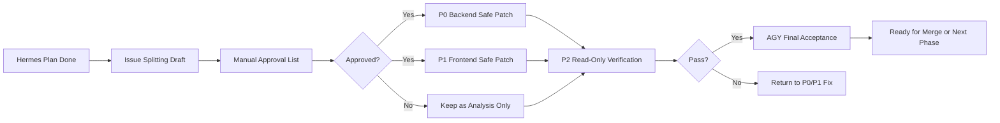
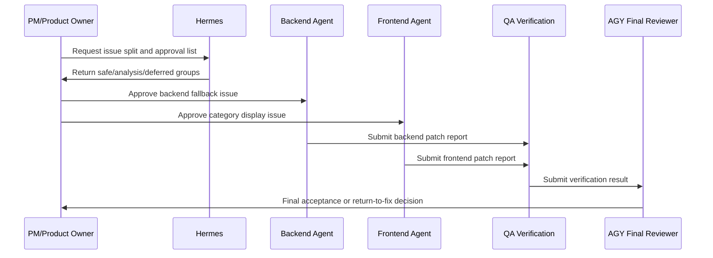

# AI-SmartBook-R1-PR4 Agent Division Flow

> Purpose: explain how to proceed after the Hermes engineering plan, using agent-based division of work.
>
> Repo: `b827262-cell/AI-SmartBook-R1-PR4`
>
> Branch: `docs/pr4-main-architecture-sqlite-policy`
>
> Related plan: `docs/ops/AI-SmartBook-R1-PR4-hermes-engineering-plan.md`

---

## 1. Current Status

Hermes has completed the planning document. The next step is **not feature coding yet**. The next step is:

1. Split issues.
2. Define patch boundaries.
3. Create a manual approval list.
4. Approve only small, safe implementation tasks.
5. Run verification before final acceptance.

Key conclusion from the Hermes plan:

- PR4 already has most SmartBook module skeletons.
- The first safe implementation candidates are:
  - SmartBook category display normalization.
  - `smart_book_settings` missing-table fallback parity.
- PDF annotations, lesson points, credits, quiz, exam, live practice, and ingestion pipeline need extra analysis before implementation.

---

## 2. Overall Flow



---

## 3. Agent Roles

| Agent role | Main responsibility | Output |
| --- | --- | --- |
| PM / Product Owner | Decide priority, confirm scope, approve or reject risky work. | Approved issue list and acceptance criteria. |
| Hermes Planning Agent | Convert analysis into issue-splitting drafts and manual approval list. | Issue split plan and approval checklist. |
| Backend Agent | Implement only approved backend safe patches. | Backend patch and validation report. |
| Frontend Agent | Implement only approved UI/display safe patches. | Frontend patch and UI validation report. |
| QA / Verification Agent | Verify build, diff boundary, UI flow, and no forbidden file changes. | Read-only verification report. |
| AGY Final Reviewer | Final acceptance after P0/P1/P2 reports. | Merge recommendation or rejection list. |
| DevOps / Release Agent | Branch hygiene, CI, deployment notes, rollback support. | Deploy checklist and rollback notes. |

---

## 4. Recommended Agent Assignment

### 4.1 Hermes Planning Agent

Use Hermes first for planning only.

```text
Agent: Hermes Planning Agent
Task: Prepare issue-splitting drafts and a manual approval list from the Hermes engineering plan.
Do not write feature code.
Do not modify schema, migrations, docker-compose, OAuth, Ask AI core, PDF reader core, or lesson-point completion logic.
```

Expected output:

- Group A: safe implementation issues.
- Group B: analysis-only issues.
- Group C: explicitly deferred items.
- Manual approval checklist.

---

### 4.2 Backend Agent

Use backend agent only after approval.

```text
Agent: OpenClaw Backend Agent or Codex Coding Agent
Task: Implement only approved backend safe patches.
First candidates:
1. smart_book_settings missing-table fallback parity.
2. Safe default return path for optional table absence.
```

Allowed first review files:

- `server/routers/smartBookRouter.ts`
- `server/routers/smartBookLearningRouter.ts`
- `server/routers/featureTogglesRouter.ts`

Not allowed:

- schema changes
- migration changes
- docker-compose changes
- OAuth porting
- MySQL/TiDB architecture porting
- Ask AI core rewrite
- PDF reader core rewrite

---

### 4.3 Frontend Agent

Use frontend agent only after approval.

```text
Agent: Claude Code, OpenClaw Frontend Agent, or Codex Coding Agent
Task: Implement only approved UI/display patches.
First candidate:
1. SmartBook category display normalization.
```

Allowed first review files:

- `client/src/lib/smartBookCategoryDisplay.ts`
- `client/src/pages/SmartBooks.tsx`
- `client/src/pages/SmartBooksBookTabs.tsx`
- `client/src/pages/AdminSmartBooks.tsx` only if needed

Expected result:

- No mojibake category icons.
- Stable category display names.
- UI behavior remains compatible with PR4.

---

### 4.4 QA / Verification Agent

Use verification agent after every approved patch.

```text
Agent: Codex CLI, AGY, Gemini Verification Agent, or read-only reviewer
Task: Verify diff boundary, build status, and user-facing SmartBook flows.
Do not modify feature code.
```

Minimum checks:

```bash
git status --short
git branch --show-current
git rev-parse --short HEAD
git diff --name-only main...HEAD
git diff -- drizzle/schema.ts
git diff --name-only main...HEAD | grep -E '(^drizzle/|migration|docker-compose|\.env|server/_core/(env|oauth|googleOAuth)\.ts)' || true
pnpm -w build
```

Verification focus:

- Book list opens.
- Single-book page opens.
- PDF still loads.
- Mobile PDF layout is not broken.
- Progress panel still works.
- Knowledge-point panel still works.
- Knowledge-point completion still works.
- No forbidden file changes.

---

### 4.5 AGY Final Reviewer

Use AGY only after implementation and verification reports are available.

```text
Agent: AGY Final Reviewer or Senior Verification Agent
Task: Decide whether the branch is ready for merge or must return to P0/P1 fixes.
```

AGY must confirm:

- Approved scope only.
- No schema or migration changes.
- No docker-compose changes.
- No OAuth/TiDB/MySQL porting.
- SmartBook UI still works.
- SQLite-safe policy is not weakened.

---

## 5. Work Groups

### Group A: Safe Implementation Candidates

These can become implementation issues after manual approval:

| Item | Agent | Reason |
| --- | --- | --- |
| SmartBook category display normalization | Frontend Agent | Low-risk UI/data display repair. |
| `smart_book_settings` fallback parity | Backend Agent | Small optional-table safety patch. |

### Group B: Analysis-Only First

These must stay as analysis before coding:

| Item | Agent | Reason |
| --- | --- | --- |
| PDF annotations portability | Hermes / QA | Contains MySQL-style DDL and `INFORMATION_SCHEMA` risk. |
| Lesson points persistence portability | Hermes / Backend reviewer | Needs schema/runtime review. |
| Credit transactions portability | Hermes / Backend reviewer | Needs DB baseline review. |

### Group C: Deferred This Round

These should not be implemented in the current SQLite-policy branch:

| Item | Reason |
| --- | --- |
| Ask AI main flow rewrite | Too central and risky for first patch. |
| Quiz / exam / live-practice schema expansion | Requires explicit data model approval. |
| Batch upload / ingestion pipeline DB changes | High DB impact; needs separate branch. |

---

## 6. Agent Handoff Flow



---

## 7. Completion Report Format

Every agent must finish in Traditional Chinese with:

```markdown
- 狀態
  - success: <完成項目>
  - failure: <失敗項目，沒有則寫「無」>
  - blocker: <阻礙項目，沒有則寫「無」>
  - permission-halt: <權限或需人工確認項目，沒有則寫「無」>
```

Recommended extra fields:

- current branch
- commit SHA
- changed files
- validation commands
- validation result
- next recommended step

---

## 8. Recommended Next Action

Ask Hermes to create:

```text
docs/ops/AI-SmartBook-R1-PR4-issue-splitting-and-approval-list.md
```

This document should contain:

1. Group A approved-candidate issue drafts.
2. Group B analysis-only issue drafts.
3. Group C deferred items.
4. Manual approval checklist.
5. Agent assignment per issue.
6. Do-not-touch boundaries.
