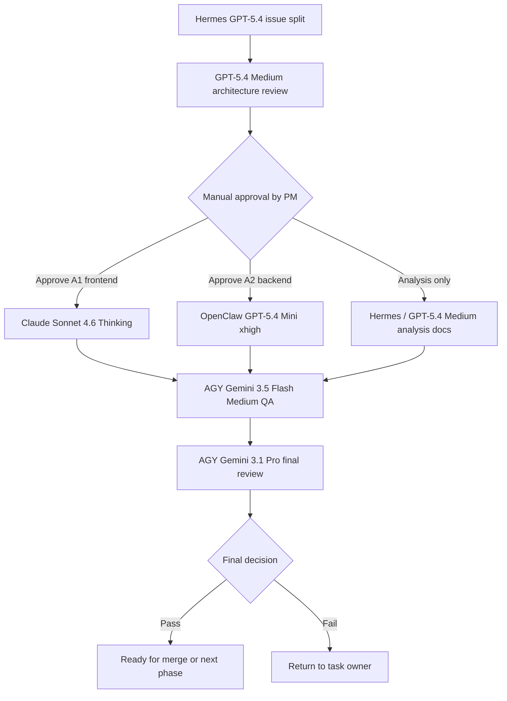

# AI-SmartBook-R1-PR4 Issue Splitting and Approval List

> Purpose: split the next PR4 work into agent-ready tasks with manual approval gates.
>
> Repo: `b827262-cell/AI-SmartBook-R1-PR4`
>
> Branch: `docs/pr4-main-architecture-sqlite-policy`
>
> Status: planning and dispatch only; no feature code implementation in this document.
>
> Related docs:
> - `docs/ops/AI-SmartBook-R1-PR4-hermes-engineering-plan.md`
> - `docs/ops/AI-SmartBook-R1-PR4-agent-division-flow.md`
> - `docs/ops/AI-SmartBook-R1-PR4-agent-assignment-matrix.md`
> - `docs/ops/AI-SmartBook-R1-PR4-image-assets-index.md`

---

## 1. Agent Assignment Summary

| No. | Agent | Model / Mode | Use for this phase |
| --- | --- | --- | --- |
| 1 | Hermes | GPT-5.4 | issue splitting, approval list, planning docs |
| 2 | GPT-5.4 Medium | GPT-5.4 Medium | architecture review and prompt refinement |
| 3 | Claude Sonnet 4.6 Thinking | Claude Sonnet 4.6 Thinking | frontend/UI category display work |
| 4 | AGY | Gemini 3.1 Pro | final acceptance and merge readiness |
| 5 | AGY | Gemini 3.5 Flash Medium | fast QA and regression verification |
| 6 | OpenClaw | GPT-5.4 Mini xhigh | approved small coding patches |

---

## 2. Current Planning Conclusion

Hermes engineering plan concluded:

1. PR4 already has most SmartBook module skeletons.
2. The first safe implementation candidates are:
   - SmartBook category display normalization.
   - `smart_book_settings` missing-table fallback parity.
3. The following areas require analysis before implementation:
   - PDF annotations persistence portability.
   - Lesson points persistence portability.
   - Credit transactions portability.
4. The following are deferred in the current SQLite-policy branch:
   - Ask AI main flow rewrite.
   - Quiz / exam / live-practice schema expansion.
   - Batch upload / ingestion pipeline database changes.

---

## 3. Execution Flow



---

## 4. Group A: Implementation Candidates Requiring Manual Approval

### A1. SmartBook Category Display Normalization

- Status: approval required before implementation.
- Primary agent: Claude Sonnet 4.6 Thinking.
- Backup coding agent: OpenClaw GPT-5.4 Mini xhigh.
- Review agent: GPT-5.4 Medium.
- QA agent: AGY Gemini 3.5 Flash Medium.
- Final reviewer: AGY Gemini 3.1 Pro.

#### Goal

Normalize SmartBook category labels and icons so users do not see mojibake or unstable category display values.

#### Expected user-facing result

- No mojibake category icons.
- Stable category display names.
- Book list category display is consistent.
- Single-book and tab display remain compatible.

#### Suggested files to inspect

- `client/src/lib/smartBookCategoryDisplay.ts`
- `client/src/pages/SmartBooks.tsx`
- `client/src/pages/SmartBooksBookTabs.tsx`
- `client/src/pages/AdminSmartBooks.tsx` only if needed and approved
- `server/routers/smartBookRouter.ts` only if API normalization is required and approved

#### Do not touch

- `drizzle/schema.ts`
- migration files
- `docker-compose.yml`
- OAuth files
- PDF reader core
- Ask AI core
- lesson-point completion logic

#### Draft agent prompt

```text
Agent: Claude Sonnet 4.6 Thinking
Repo: b827262-cell/AI-SmartBook-R1-PR4
Branch: docs/pr4-main-architecture-sqlite-policy
Task: Implement only SmartBook category display normalization after manual approval.
Inspect the current PR4 category display flow and compare it with the Hermes engineering plan.
Use minimal frontend/UI changes. Do not modify schema, migrations, docker-compose, OAuth, PDF reader core, Ask AI core, or lesson-point completion logic.
GitHub execution in English.
Final termination report in Traditional Chinese with success, failure, blocker, and permission-halt.
```

#### Acceptance criteria

- Book list renders category names and icons without mojibake.
- Unknown category values fallback to a safe default.
- No unrelated UI refactor.
- No forbidden files changed.

---

### A2. smart_book_settings Missing-Table Fallback Parity

- Status: approval required before implementation.
- Primary agent: OpenClaw GPT-5.4 Mini xhigh.
- Review agent: GPT-5.4 Medium.
- QA agent: AGY Gemini 3.5 Flash Medium.
- Final reviewer: AGY Gemini 3.1 Pro.

#### Goal

Prevent SmartBook pages from failing when optional `smart_book_settings` data is unavailable or missing in the runtime environment.

#### Expected user-facing result

- SmartBook pages do not crash due to optional settings-table access.
- Safe defaults are returned when optional settings cannot be read.
- Existing API route names and output shape remain compatible.

#### Suggested files to inspect

- `server/routers/smartBookRouter.ts`
- `server/routers/smartBookLearningRouter.ts`
- `server/routers/featureTogglesRouter.ts`

#### Do not touch

- `drizzle/schema.ts`
- migration files
- `docker-compose.yml`
- OAuth files
- PDF reader core
- Ask AI core
- lesson-point completion logic

#### Draft agent prompt

```text
Agent: OpenClaw GPT-5.4 Mini xhigh
Repo: b827262-cell/AI-SmartBook-R1-PR4
Branch: docs/pr4-main-architecture-sqlite-policy
Task: Implement only smart_book_settings missing-table fallback parity after manual approval.
Use small backend guards or safe fallback returns. Keep tRPC route names and API response shapes unchanged.
Do not change schema, migrations, docker-compose, OAuth, PDF reader core, Ask AI core, or lesson-point completion logic.
GitHub execution in English.
Final termination report in Traditional Chinese with success, failure, blocker, and permission-halt.
```

#### Acceptance criteria

- Missing optional settings data returns safe defaults.
- SmartBook list and single-book page remain usable.
- No schema or migration changes.
- No forbidden files changed.

---

## 5. Group B: Analysis-Only Tasks

### B1. PDF Annotations Persistence Portability Analysis

- Status: analysis only.
- Primary agent: Hermes GPT-5.4.
- Review agent: GPT-5.4 Medium.
- Final reviewer: AGY Gemini 3.1 Pro.

#### Reason

Hermes plan found MySQL-oriented risk in PDF notes/highlights paths. This area must not be changed before portability analysis.

#### Suggested files to inspect

- `server/routers/pdfHighlightsRouter.ts`
- `server/routers/pdfImageNotesRouter.ts`
- `client/src/components/PdfViewer.tsx`
- `client/src/pages/SmartBooksBookDetail.tsx`

#### Draft agent prompt

```text
Agent: Hermes GPT-5.4
Task: Analyze PDF annotations persistence portability under the PR4 SQLite-safe policy.
Do not implement code. Produce a Markdown analysis report with current behavior, risk, table usage, and a recommended future-safe design.
Final report in Traditional Chinese with success, failure, blocker, and permission-halt.
```

---

### B2. Lesson Points Persistence Portability Analysis

- Status: analysis only.
- Primary agent: Hermes GPT-5.4.
- Review agent: GPT-5.4 Medium.
- Final reviewer: AGY Gemini 3.1 Pro.

#### Reason

Lesson points already exist, but completion persistence and runtime compatibility need review before changes.

#### Suggested files to inspect

- `server/routers/lessonPointsRouter.ts`
- `client/src/pages/SmartBooksChapterLearning.tsx`
- `client/src/pages/SmartBooksBookTabs.tsx`

#### Draft agent prompt

```text
Agent: Hermes GPT-5.4
Task: Analyze lesson points and guided learning persistence portability.
Do not implement code. Identify current routes, tables, writes, completion flow, and safe future patch boundaries.
Final report in Traditional Chinese with success, failure, blocker, and permission-halt.
```

---

### B3. Credit Transactions / Credits Tab Portability Analysis

- Status: analysis only.
- Primary agent: Hermes GPT-5.4.
- Review agent: GPT-5.4 Medium.
- Final reviewer: AGY Gemini 3.1 Pro.

#### Reason

Credits are used by SmartBook tabs, but persistence and optional-table fallback need separate review.

#### Suggested files to inspect

- `server/routers/smartBookLearningRouter.ts`
- `client/src/pages/SmartBooksBookDetail.tsx`
- `client/src/pages/SmartBooksBookTabs.tsx`

#### Draft agent prompt

```text
Agent: Hermes GPT-5.4
Task: Analyze credit transactions and credits tab portability.
Do not implement code. Identify table usage, fallback behavior, UI dependency, and safe future implementation options.
Final report in Traditional Chinese with success, failure, blocker, and permission-halt.
```

---

## 6. Group C: Deferred Items for This Branch

These are not approved for implementation in this SQLite-policy branch.

| Item | Reason | Required next step |
| --- | --- | --- |
| Ask AI main flow rewrite | Core learning flow; high regression risk. | Separate design and approval branch. |
| Quiz / exam / live-practice schema expansion | Requires data model approval. | Separate schema review branch. |
| Batch upload / ingestion pipeline DB changes | High database and import impact. | Separate ingestion design branch. |
| OAuth feature porting | Out of scope for SQLite-policy branch. | Separate OAuth branch only. |
| TiDB/MySQL architecture porting | Conflicts with current policy goal. | Separate database migration plan. |

---

## 7. Manual Approval Checklist

Before any Group A implementation starts, PM / Product Owner must approve:

- [ ] Task title and issue ID.
- [ ] Primary agent and backup agent.
- [ ] Allowed files.
- [ ] Do-not-touch files.
- [ ] Expected user-facing behavior.
- [ ] Validation commands.
- [ ] Rollback plan.
- [ ] Final report format.

Approval wording:

```text
Approved for implementation: <task ID>
Approved agent: <agent/model>
Allowed files: <file list>
Do-not-touch boundaries confirmed: yes
Final report required in Traditional Chinese: yes
```

---

## 8. Validation Checklist for Group A Patches

Each implementation patch must be followed by read-only verification.

Suggested commands:

```bash
git status --short
git branch --show-current
git rev-parse --short HEAD
git diff --name-only main...HEAD
git diff -- drizzle/schema.ts
git diff --name-only main...HEAD | grep -E '(^drizzle/|migration|docker-compose|\.env|server/_core/(env|oauth|googleOAuth)\.ts)' || true
pnpm -w build
```

User-facing regression checklist:

- [ ] Book list opens.
- [ ] Single-book page opens.
- [ ] PDF loads.
- [ ] Mobile PDF layout is not broken.
- [ ] Progress panel still works.
- [ ] Knowledge-point panel still works.
- [ ] Knowledge-point completion still works.
- [ ] Category display is stable.
- [ ] Missing optional settings do not crash SmartBook pages.

---

## 9. Agent Dispatch Order

1. Hermes GPT-5.4 completes this issue-splitting and approval list.
2. GPT-5.4 Medium reviews and refines the Group A prompts.
3. PM manually approves A1 and/or A2.
4. Claude Sonnet 4.6 Thinking handles A1 frontend category display work if approved.
5. OpenClaw GPT-5.4 Mini xhigh handles A2 backend fallback work if approved.
6. AGY Gemini 3.5 Flash Medium performs fast QA.
7. AGY Gemini 3.1 Pro performs final acceptance.

---

## 10. Current Recommended First Approval

Recommended first approval order:

1. A1 SmartBook Category Display Normalization.
2. A2 smart_book_settings Missing-Table Fallback Parity.
3. B1/B2/B3 analysis reports.

Reason:

- A1 is low-risk and user-visible.
- A2 addresses runtime stability.
- B1/B2/B3 clarify future database portability before deeper feature work.

---

## 11. Termination Report Requirement

Every agent must finish in Traditional Chinese:

```markdown
- 狀態
  - success: <完成項目>
  - failure: <失敗項目，沒有則寫「無」>
  - blocker: <阻礙項目，沒有則寫「無」>
  - permission-halt: <權限或需人工確認項目，沒有則寫「無」>
```

---

## 12. Group B Requested Matrix (Traditional Chinese)

日期：2026-07-05
作者：Hermes Agent
模式：issue splitting / approval routing，非實作

本段是依使用者指定格式補入的 Group B 摘要，供後續派工與人工核准直接引用。

## Group B：只做分析，不施工

| ID | 任務 | Agent | 原因 |
| --- | --- | --- | --- |
| B1 | PDF Annotations Persistence Portability Analysis | Hermes GPT-5.4 | PDF notes/highlights 有 MySQL-oriented 風險 |
| B2 | Lesson Points Persistence Portability Analysis | Hermes GPT-5.4 | 知識點完成流程需先審查 |
| B3 | Credit Transactions / Credits Tab Portability Analysis | Hermes GPT-5.4 | credits tab 與 optional table fallback 需分開分析 |

## Group B 工作邊界

### B1 PDF Annotations Persistence Portability Analysis

分析範圍：
- `server/routers/pdfHighlightsRouter.ts`
- `server/routers/pdfImageNotesRouter.ts`
- `drizzle/schema.ts`
- SmartBook notebook / splitNoteMode / PdfViewer 對應前端

分析重點：
1. 是否依賴 MySQL DDL / `AUTO_INCREMENT` / `INFORMATION_SCHEMA`
2. 是否有 runtime auto-create table / auto-alter column 行為
3. 是否存在 SQLite baseline 不相容的欄位型別或 migration 假設
4. 前端 notebook 與 image-notes 是否能在不改 schema 的前提下 degrade gracefully

輸出物：
- 風險分級
- SQLite-safe / not-safe 邊界
- 是否值得另開 implementation issue

不做：
- 不改 schema
- 不補 migration
- 不改 router 行為
- 不改前端 notebook/persistence 邏輯

### B2 Lesson Points Persistence Portability Analysis

分析範圍：
- `server/routers/lessonPointsRouter.ts`
- `server/routers/smartBookRouter.ts` 中 lesson-point / guided learning 關聯路徑
- `client/src/pages/SmartBooksChapterLearning.tsx`

分析重點：
1. 知識點完成、腳本回放、進度寫回涉及哪些表
2. lesson points 完成狀態是否綁定既有 MySQL schema 假設
3. 若 SQLite baseline 缺表或缺欄位，哪些流程會炸裂、哪些可 fallback
4. 目前「已存在功能」與「可安全移植」之間的差距

輸出物：
- lesson points persistence 依賴圖
- 需要人工核准的風險點
- 是否可拆成低風險 read-only / fallback-only 後續 issue

不做：
- 不改知識點完成流程
- 不改 sendMessage / guided learning 主流程
- 不新增 lesson tables / migration

### B3 Credit Transactions / Credits Tab Portability Analysis

分析範圍：
- `server/routers/smartBookLearningRouter.ts`
- `server/routers/points.ts`
- `server/routers/featureTogglesRouter.ts`
- `drizzle/schema.ts` 中 `credit_transactions` 與相關依賴
- `client/src/pages/SmartBooksBookDetail.tsx` credits tab

分析重點：
1. credits tab UI 查哪些 query
2. `credit_transactions` 缺表時，哪些功能只是顯示失敗，哪些會阻斷主流程
3. optional table fallback 與 accounting/credits 正式資料一致性是否能分離
4. 哪些可以做「安全 fallback」，哪些必須先補表後才可施工

輸出物：
- credits tab portability 風險表
- fallback-safe / schema-required 清單
- 是否應拆成兩張 issue：UI fallback 與 schema remediation

不做：
- 不調整 credit 規則
- 不補 `credit_transactions` 表
- 不改 autoGrant / accounting 流程

## 人工核准規則

Group B 一律先分析，不直接施工。

只有在以下條件同時滿足時，才建議進入 implementation issue：
1. 已完成對應分析文件
2. 已標出 SQLite-safe 邊界
3. 已確認不會默默擴大到 Ask AI / batchUpload / exam / credits schema remediation
4. 使用者明確人工核准

## 建議後續順序

1. 先完成 B1 PDF annotations portability analysis
2. 再完成 B2 lesson points persistence portability analysis
3. 最後完成 B3 credit transactions / credits tab portability analysis
4. 三份分析都完成後，再決定是否拆 implementation issue

## 結論

Group B 的核心原則是：
- 先釐清資料持久化與 SQLite baseline 的相容邊界
- 不把「現有功能存在」誤判成「可以安全導入」
- 沒有分析結論與人工核准前，不進行任何實作
