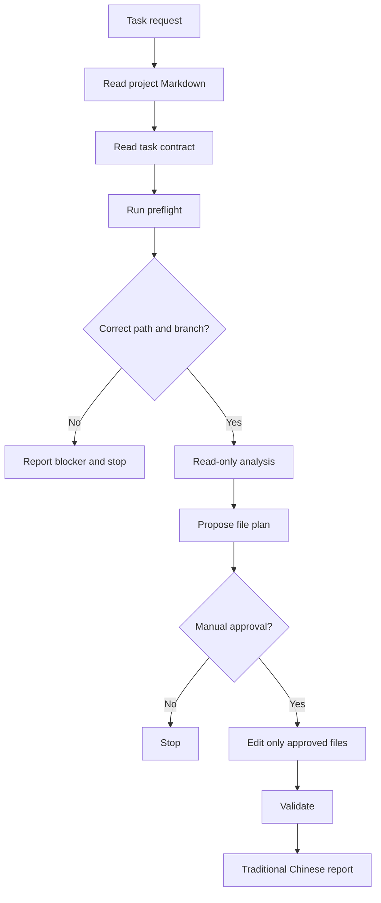

# AI-SmartBook-R1-PR4 OpenClaw Execution Control

> Purpose: define how OpenClaw should work on AI-SmartBook-R1-PR4 tasks without running in the wrong project.
>
> Repo: `b827262-cell/AI-SmartBook-R1-PR4`
>
> Branch: `docs/pr4-main-architecture-sqlite-policy`
>
> Target path: `/home/b822726/project/AI-SmartBook-R1-PR4`
>
> Reference path: `/home/b822726/project/ai_tutor_helper_20260704_TUFA16`

---

## 1. Why Control Is Needed

OpenClaw is an agent. It can reason, search, infer intent, choose files, and edit files.

This means a broad instruction can be applied to the wrong project if the current workspace is wrong.

Example:

```text
User says: category display normalization
  ↓
Agent reads current workspace
  ↓
Current workspace is not AI-SmartBook-R1-PR4
  ↓
Agent finds another category-like feature
  ↓
Wrong project gets changed
```

---

## 2. Required Flow



---

## 3. OpenClaw Must Do First

Before any code change, OpenClaw must:

1. Confirm current path is `/home/b822726/project/AI-SmartBook-R1-PR4`.
2. Confirm current branch is `docs/pr4-main-architecture-sqlite-policy`.
3. Confirm planning docs exist under `docs/ops/`.
4. Confirm reference repo exists at `/home/b822726/project/ai_tutor_helper_20260704_TUFA16`.
5. Report readiness.
6. Wait for explicit approval before implementation.

If any check fails, OpenClaw must report `blocker` and stop.

---

## 4. Required Planning Docs

OpenClaw must be able to read:

```text
docs/ops/AI-SmartBook-R1-PR4-issue-splitting-and-approval-list.md
docs/ops/AI-SmartBook-R1-PR4-agent-assignment-matrix.md
docs/ops/AI-SmartBook-R1-PR4-hermes-engineering-plan.md
```

---

## 5. Task Contract Concept

Every task should have a small contract that states:

```text
task_id
task_name
working_directory
branch
reference_repository
allowed_files
blocked_files
validation_commands
manual_approval_required
report_language
```

A task is not ready if these fields are missing.

---

## 6. Manual Approval Rule

OpenClaw must stop after analysis and file-plan proposal.

Implementation can start only after approval text like:

```text
Approved for implementation: <task ID>
Approved files: <file list>
Boundaries confirmed: yes
Final report required in Traditional Chinese: yes
```

---

## 7. Final Report Format

Every OpenClaw run must finish in Traditional Chinese:

```markdown
- 狀態
  - success: <完成項目>
  - failure: <失敗項目，沒有則寫「無」>
  - blocker: <阻礙項目，沒有則寫「無」>
  - permission-halt: <權限或需人工確認項目，沒有則寫「無」>
```

---

## 8. Practical Meaning

Use this pattern:

```text
Task request
  ↓
Markdown guide
  ↓
Task contract
  ↓
Preflight
  ↓
Manual approval
  ↓
Approved implementation
  ↓
Validation
  ↓
Traditional Chinese report
```

This makes OpenClaw work as a constrained project operator instead of a broad autonomous agent.
