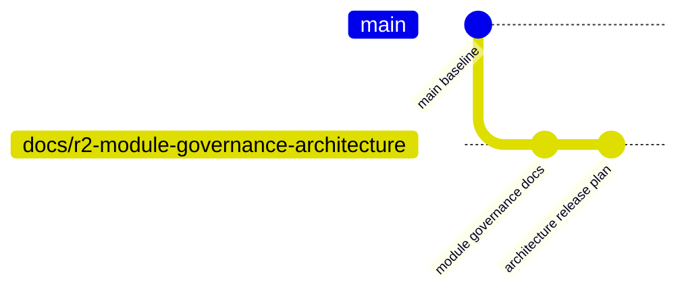
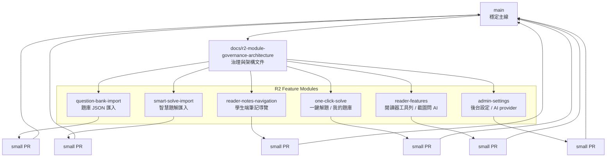
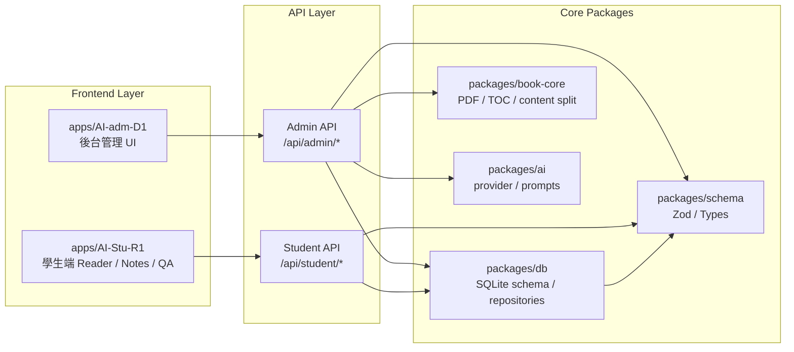
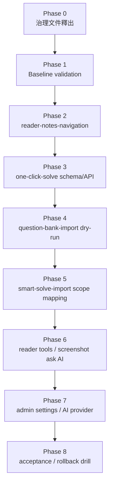
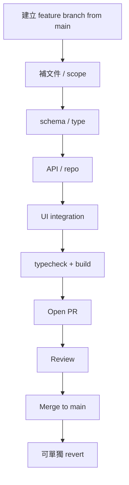
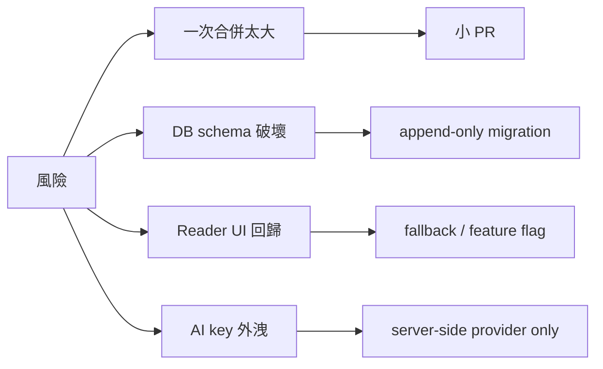

# AI-SmartBook-R2 模組治理與整合架構方案釋出

Date: 2026-06-25  
Repository: `b827262-cell/AI-SmartBook-R1-PR4`  
Base branch: `main`  
Working branch: `docs/r2-module-governance-architecture`  
Status: `plan-released / docs-only`

## 1. 目前專案狀態

目前 GitHub branch 畫面顯示專案已被簡化為清楚的兩層狀態：

| 區塊 | 分支 | 狀態 | 說明 |
| --- | --- | --- | --- |
| Default | `main` | default branch | 作為唯一穩定基底 |
| Your branches / Active branches | `docs/r2-module-governance-architecture` | ahead 1+ | 文件型治理分支，負責釋出 R2 模組架構與整合規則 |

這代表目前不再是多分支混戰狀態，而是適合先建立「模組治理規則」再進入功能實作的乾淨狀態。



## 2. 方案總目標

本方案的目標不是馬上把所有 R2 功能一次搬進來，而是先建立一套可以長期維護的模組化治理方式。

核心目標：

1. `main` 永遠保持可啟動、可建置、可回退。
2. 每個 R2 功能模組使用獨立 branch / PR。
3. 文件、schema、API、UI、驗證分階段釋出。
4. 不直接 bulk merge 舊分支或大型功能包。
5. 每次只整合一個可驗收功能。

## 3. 主架構圖



## 4. 分層架構

R2 後續功能必須遵守三層邊界：



### 邊界規則

| 規則 | 說明 |
| --- | --- |
| Student frontend 不直接碰 DB | 學生端只呼叫 `/api/student/*` |
| Admin frontend 不直接碰 AI key | AI key / provider 設定留在 server side |
| Schema 先行 | 新功能先定義 schema，再接 API / UI |
| DB append-only | 盡量新增表或欄位，不破壞舊資料 |
| 每模組可關閉 | route-level 或 feature flag 可停用 |

## 5. 模組釋出順序



### Phase 0 — 本文件

目的：先把架構與治理規則固定，避免後續 agent 或人工操作把功能一次混入。

輸出：

```text
docs/r2/AI-SmartBook-R2-module-governance-architecture-release-20260625.md
```

### Phase 1 — Baseline validation

目的：確認 `main` 可建置、可作為功能整合基準。

必要驗證：

```bash
corepack enable
pnpm install --frozen-lockfile
pnpm --filter AI-adm-D1 typecheck
pnpm --filter AI-adm-D1 build
pnpm --filter AI-Stu-R1 typecheck
pnpm --filter AI-Stu-R1 build
```

### Phase 2 — Reader Notes Navigation

目的：先完成學生端筆記導覽，讓 AI 筆記能回到書本章節 / 頁碼。

範圍：

- `/notes` / `/my-notes`
- notes list page
- student client notes methods
- `smart_book_notes` CRUD API
- reader jump fallback

### Phase 3 — One-click Solve Schema/API

目的：先完成一鍵解題與我的題庫的資料邊界，不急著做完整 UI。

範圍：

- question item schema
- solve result schema
- my question bank repository
- minimal API contract

### Phase 4 — Question Bank Import Dry-run

目的：題庫 JSON 先做到驗證與預覽，不直接大量寫入。

範圍：

- JSON schema validation
- duplicate detection
- dry-run report
- error list
- admin preview page

### Phase 5 — Smart Solve Import Scope Mapping

目的：智慧題解資料要能對應到 book / chapter / page。

範圍：

- smart solve schema
- scope mapping builder
- chapter/page fallback
- admin mapping preview

### Phase 6 — Reader Tools / Screenshot Ask AI

目的：閱讀器工具列、截圖問 AI、圖片挑選等功能逐一整合。

規則：一個 reader feature 一個 PR，不一次合併。

### Phase 7 — Admin Settings / AI Provider

目的：後台 AI 設定、Google knowledge、provider runtime 分開整合。

規則：AI key 不進前端，不硬寫。

## 6. PR 治理流程圖



每個 PR 必須包含：

```text
## Scope
## Module
## Files changed
## Validation
## Rollback
## Not included
```

## 7. 模組與路徑對照

| 模組 | Schema | DB / Repo | Admin | Student |
| --- | --- | --- | --- | --- |
| reader-notes-navigation | `smartBookNote.schema.ts` | `smartBookNote.repo.ts` | optional | notes page / reader jump |
| one-click-solve | `question.schema.ts`, `solve.schema.ts` | `questionBank.repo.ts` | optional | MyQuestionBankPanel |
| question-bank-import | `questionBankImport.schema.ts` | `questionBankImport.repo.ts` | import preview | none |
| smart-solve-import | `smartSolveImport.schema.ts` | `smartSolveImport.repo.ts` | scope mapping | optional display |
| reader-features | existing reader types | optional access log | feature toggle | toolbar / screenshot |
| admin-settings | settings schema | settings repo | settings pages | none |

## 8. 風險控制



## 9. 立即下一步

建議接下來照以下順序執行：

1. 將本文件 PR 到 `main`。
2. 合併後建立 `feat/r2-baseline-validation-20260625`。
3. 跑完整 typecheck / build 並寫 validation report。
4. 再建立第一個功能 PR：`feat/r2-reader-notes-navigation-20260625`。

第一個功能 PR 不應超過 notes navigation 範圍，避免又回到多功能混合整合。
